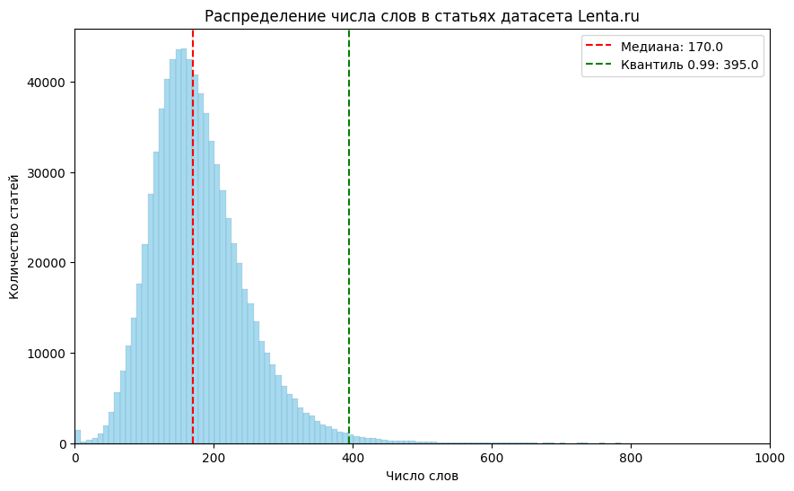

# Цель : Обучение ретривера  RAG системы 

# Архитектура:

- Dense ретривер на основе ai-forever/FRIDA
# Синтетический QA датасет

Датасет был сгенерирован на основе корпуса LENTA.ru. Анализ распределения длин показал, что почти все статьи содержат менее 400 слов.

Так как в качестве dense-ретривера была выбрана модель FRIDA с контекстным окном 512 токенов, этап чанкирования не потребовался — подавляющее большинство статей полностью помещается в это ограничение.
Из исходного корпуса были удалены выбросы:
- статьи короче 50 слов
- статьи длиннее 400 слов

После фильтрации случайным образом было отобрано 30 000 статей. На их основе был сгенерирован синтетический QA-датасет с использованием LLM  
Vikhrmodels/QVikhr-3-4B-Instruction — модели, дообученной на русском языке на базе Qwen-3.

Для каждой статьи генерировалось по два вопроса с системным промптом, запрещающим общие и абстрактные формулировки. Генерация выполнялась в формате bfloat16 на GPU A100 80 GB с батчем 208, что позволило существенно ускорить инференс.
Часть вопросов была некорректно сгенерирована и потому отброшена. Было сформировано 56 906 пар вопрос-статья.

## Обучение и валидация ретривера

Базовые метрики FRIDA (без дообучения), оценка проводилась по косинусному сходству с корректным использованием инструктивных префиксов FRIDA.
Погрешности метрик оценивались методом bootstrap.

| Метрика   | Значение | Погрешность |
| --------- | -------- | ----------- |
| Recall@1  | 0.788    | 0.005       |
| Recall@5  | 0.906    | 0.003       |
| Recall@10 | 0.934    | 0.003       |
| MRR@5     | 0.834    | 0.004       |
| MRR@10    | 0.838    | 0.004       |

Для дообучения поверх замороженного энкодера FRIDA использовалась функция потерь:
**`MultipleNegativesRankingLoss`** 

Обучение проводилось на A100 80 GB в Google Colab с батчем 4098, что особенно эффективно для данного лосса, поскольку все элементы батча, кроме позитивной пары, используются как in-batch негативы. 

После обучения MLP голов при замороженной FRIDA:
![Pasted image 20260114233645.png]

| Метрика   | Значение | Погрешность |
| --------- | -------- | ----------- |
| Recall@1  | 0.790    | 0.005       |
| Recall@5  | 0.915    | 0.003       |
| Recall@10 | 0.946    | 0.003       |
| MRR@5     | 0.839    | 0.004       |
| MRR@10    | 0.844    | 0.004       |

Поскольку метрики обладают ненулевой дисперсией, был проведён статистический тест Фишера (p < 0.01) с использованием библиотеки `ranx` для проверки значимости различий между моделями.

| #   | Model       | Recall@10 | MRR@10 |
| --- | ----------- | --------- | ------ |
| a   | FRIDA       | 0.934     | 0.838  |
| b   | FRIDA + MLP | 0.946ᵃ    | 0.844  |
Тест показал что FRIDA + MLP показали статистически значимо лучший результат по Recall@10.

На следующем этапе была предпринята попытка дообучения с использованием hard negatives, полученных от BM25. Для этого:

- learning rate был уменьшен на порядок;
- для каждого запроса добавлялось k ≈ 1–2 BM25-негатива;
- была снижена температура лосса.

Лучший график обучения, который удалось получить в результате экспериментов:
![Pasted image 20260117223748.png]
![Pasted image 20260119004634.png]

Как видно из графиков изменения минимальные, в результате обучения на негативах от BM25 положительного эффекта добиться не удалось, для того чтобы понять причину необходимо провести валидацию синтетичсекого датасета.
# Дальнейшие идеи:

1) Необходимо провести валидацию синтетического QA датасета, так как часть вопросов может оказаться невалидным. Это возможно реализовать через библиотеку Distilabel или RAGAS.
2) Возможен переход к гибридному retrieval-pipeline, так как RRF не учитывает качество источников, нужно будет экспериментировать с ширинами списков и весами в RRF.
- независимый поиск с помощью FRIDA и BM25
- объединение ранкингов через Reciprocal Rank Fusion (RRF).
1) Также с помощью библиотеки RAGAS можно провести эксперименты по уменьшению процента галлюцинаций у генератора RAG-системы, к примеру, поэкспериментировать с системными промтами.

